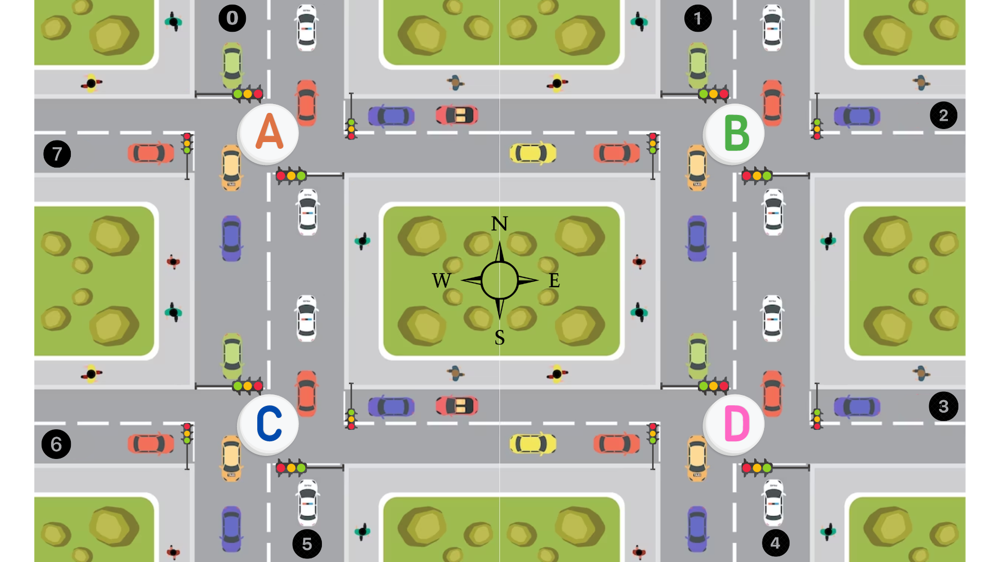

# Projeto 3 - Sistema de Controle de Tráfego com FreeRTOS

---

## Descrição Geral
    Este projeto implementa um sistema de controle de semáforos para quatro cruzamentos (A, B, C, D)
    utilizando o sistema operacional em tempo real FreeRTOS. O sistema simula o fluxo de veículos
    através desses cruzamentos, controlando os semáforos para garantir um tráfego seguro e eficiente.
    Cada cruzamento possui quatro semáforos que controlam as direções norte-sul e leste-oeste.

## Funcionalidades
    Múltiplas Tasks: O projeto cria tasks separadas para cada cruzamento e para os veículos. Essas
    tasks são responsáveis por controlar o estado dos semáforos e simular o movimento dos carros.
    
    Controle com Semáforos (FreeRTOS): São utilizados semáforos para gerenciar o acesso aos recursos
    compartilhados, garantindo que apenas um veículo atravesse o cruzamento de cada vez.
    
    Geração Aleatória de Veículos: Os veículos são gerados aleatoriamente, com diferentes velocidades
    e rotas pelos cruzamentos.
    
    Controle em Tempo Real: O sistema simula o comportamento em tempo real utilizando funcionalidades
    do FreeRTOS, como tasks, semáforos e atrasos (delays).
    
    Estados dos Semáforos: Cada semáforo pode ter três estados: verde, amarelo e vermelho. O sistema
    altera esses estados com base nas condições atuais de tráfego e nas posições dos veículos.

## Arquitetura do Sistema
    Tasks: Cada cruzamento possui uma task dedicada que controla os semáforos. Uma task adicional é 
    responsável por simular o movimento dos veículos pelos cruzamentos.
    
    Controle de Semáforos: Os semáforos em cada cruzamento são controlados de forma independente, com
    tempos de ciclo programados para mudar de verde para amarelo e vermelho. As tasks controlam os ciclos
    dos semáforos, alternando os estados para garantir o fluxo contínuo de veículos.
    
    Semáforos (FreeRTOS): São utilizados semáforos para coordenar o tráfego e evitar colisões. Eles garantem
    que apenas um veículo por vez possa atravessar um cruzamento, respeitando os ciclos dos semáforos.
    
    Simulação de Tráfego: Veículos são gerados em intervalos de tempo aleatórios, com trajetórias
    pré-determinadas pelos cruzamentos. A velocidade dos veículos e a sua rota variam conforme os cruzamentos,
    simulando um ambiente real de tráfego.

## Estrutura do Código
    main.c: Arquivo principal onde estão implementadas as tasks e a lógica do sistema de controle de tráfego.
    
    semáforos: Semáforos são utilizados para sincronizar o tráfego.
    
    tasks: As tasks controlam os semáforos e simulam o fluxo de veículos.

## Fluxograma do algoritmo
    

## Demonstração
    Link de acesso ao vídeo no YouTube: 

## Desenvolvedores
    Matheus Lucas   (matheuslucas.farias@ee.ufcg.edu.br)
    Tâmara Ruth     (tamara.santos@ee.ufcg.edu.br)
    Tulio Tavares   (tulio.tavares@ee.ufcg.edu.br)

  
